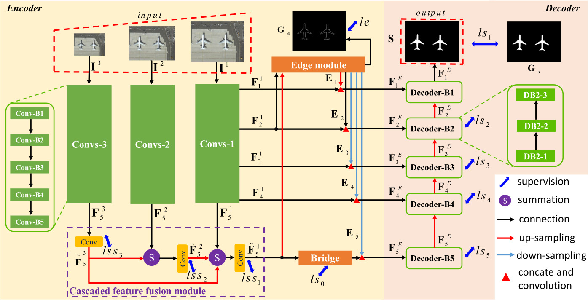
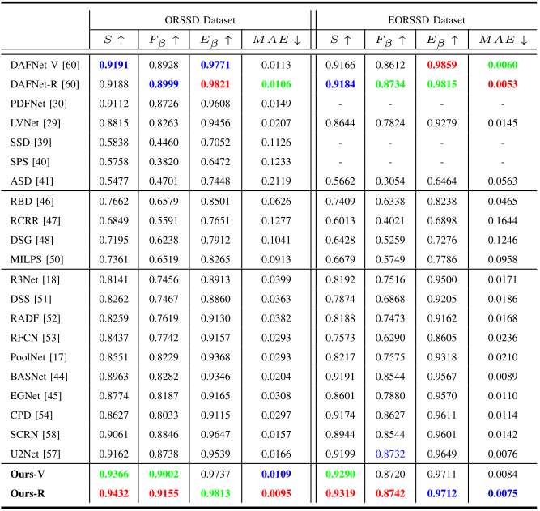
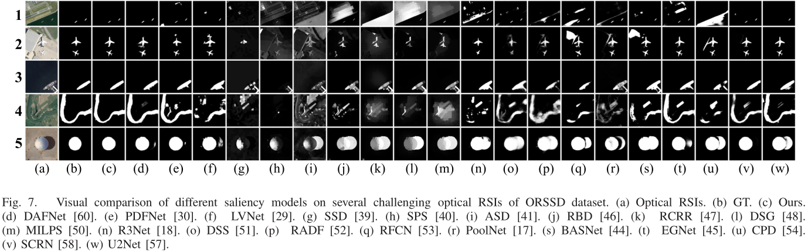
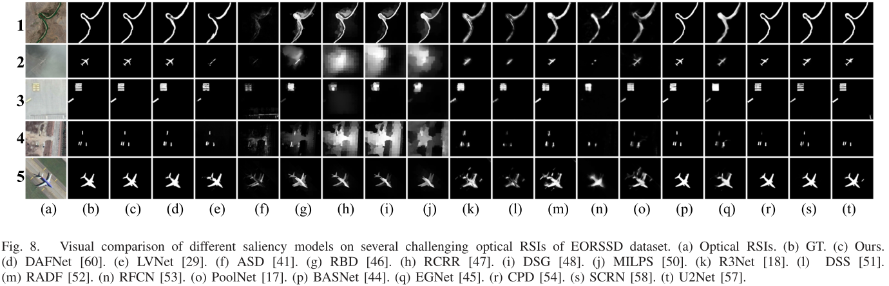

# EMFINet (TGRS 2021)
'[Edge-Aware Multiscale Feature Integration Network for Salient Object Detection in Optical Remote Sensing Images](https://ieeexplore.ieee.org/stampPDF/getPDF.jsp?tp=&arnumber=9474908&ref=aHR0cHM6Ly9pZWVleHBsb3JlLmllZWUub3JnL2Fic3RyYWN0L2RvY3VtZW50Lzk0NzQ5MDg=)', [Xiaofei Zhou](https://scholar.google.com.hk/citations?hl=zh-CN&user=2PUAFW8AAAAJ), [Kunye Shen](https://scholar.google.com.hk/citations?hl=zh-CN&user=q6_PkywAAAAJ), [Zhi Liu](https://scholar.google.com.hk/citations?hl=zh-CN&user=Sd5VB2cAAAAJ), [Chen Gong](https://scholar.google.com.hk/citations?user=guttoBwAAAAJ&hl=zh-CN), Jiyong Zhang, and Chenggang Yan.

## Required libraries

Python 3.7  
numpy 1.18.1  
scikit-image 0.16.2  
PyTorch 1.4.0  
torchvision 0.5.0  
glob  

The SSIM loss is adapted from [pytorch-ssim](https://github.com/Po-Hsun-Su/pytorch-ssim/blob/master/pytorch_ssim/__init__.py).

## Usage
1. Clone this repo
```
https://github.com/Kunye-Shen/EMFINet.git
```
2. Download the results from [GoogleDrive](https://drive.google.com/file/d/1sICLcxUC70BOq0Hw0OjTq8ya1hsqXuZu/view?usp=sharing) or [baidu](https://pan.baidu.com/s/1Ho-n8q3913dDzdC7N6sntQ) extraction code: vvux.

## Architecture


## Quantitative Comparison


## Qualitative Comparison
### ORSSD


### EORSSD


## Citation
```
@article{zhou2021edge,
  title={Edge-Aware Multiscale Feature Integration Network for Salient Object Detection in Optical Remote Sensing Images},
  author={Zhou, Xiaofei and Shen, Kunye and Liu, Zhi and Gong, Chen and Zhang, Jiyong and Yan, Chenggang},
  journal={IEEE Transactions on Geoscience and Remote Sensing},
  year={2021},
  publisher={IEEE}
}
```
